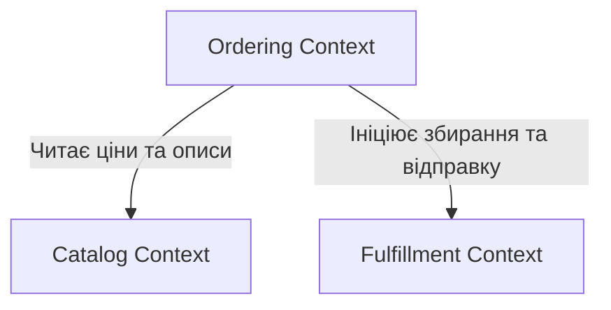

# Стратегічний дизайн системи GamingStore

**Курс:** Технології доменної інженерії  
**Лабораторна робота №3**

---

## 1. Виявлення подій та команд (Event Storming)

Процес Event Storming розпочався з фази хаотичного моделювання (Chaotic Exploration), під час якої на загальному часовому таймлайні зліва направо були розміщені ключові бізнес-події (Domain Events). Далі до них були додані команди (Commands), які ініціюють ці події, та актори. На фінальному кроці пов'язані між собою події та команди були згруповані навколо Агрегатів (Aggregates).

Під час сесії були детально проаналізовані наступні бізнес-кейси, які визначили поведінку системи:

1. **Кейс 1: Успішний шлях клієнта (Happy Path)**
   Клієнт додає гру до кошика (`AddProductToCart`). Після оформлення генерується подія `OrderPlaced`, що запускає процес оплати (`RequestPayment`). Після підтвердження від банку (`PaymentSucceeded`), система паралельно запускає резервування товару на складі (`ReserveStock`) та передає замовлення логістам (`PrepareShipment`).

2. **Кейс 2: Відхилення оплати та тайм-аут (Payment Failure & Timeout)**
   Якщо на картці клієнта недостатньо коштів, команда `ProcessPayment` завершується подією `PaymentFailed`. Система не скасовує замовлення миттєво, а очікує повторної спроби. Якщо подія `PaymentSucceeded` не настає протягом 30 хвилин, система автоматично ініціює команду `CancelOrder`.

3. **Кейс 3: Конкурентне замовлення останньої копії (Out of Stock Conflict)**
   Два клієнти одночасно оформлюють замовлення на останню фізичну копію гри. Обидва генерують `OrderPlaced` і можуть успішно оплатити товар. Однак агрегат Inventory під час резервування для другого клієнта виявить відсутність товару і згенерує подію `OutOfStock`. Це стане тригером для компенсаційної транзакції: системі доведеться ініціювати повернення коштів та виконати `CancelOrder` для другого клієнта.

Аналіз цих бізнес-процесів платформи GamingStore дозволив остаточно виділити наступні агрегати, які відповідають за консистентність даних:

| Агрегат                          | Відповідальність                                     | Команди (Commands)                                           | Події (Domain Events)                                                 |
| :------------------------------- | :--------------------------------------------------- | :----------------------------------------------------------- | :-------------------------------------------------------------------- |
| **ShoppingCart** (Кошик покупок) | Формування замовлення до моменту фіксації ціни.      | `AddProductToCart` `RemoveProductFromCart` `ClearCart` | `ProductAddedToCart` `ProductRemovedFromCart` `CartCleared`     |
| **Order** (Замовлення)           | Фіксація наміру придбати товари за узгодженою ціною. | `PlaceOrder` `CancelOrder`                                | `OrderPlaced` `OrderCancelled`                                     |
| **Payment** (Оплата)             | Фінансові транзакції та їхні статуси.                | `RequestPayment` `ProcessPayment` `FailPayment`        | `PaymentRequested` `PaymentSucceeded` `PaymentFailed`           |
| **Inventory** (Складські запаси) | Контроль наявності фізичних копій ігор чи консолей.  | `ReserveStock` `DeductStock` `ReleaseStock`            | `StockReserved` `StockDeducted` `StockReleased` `OutOfStock` |
| **Shipment** (Доставка)          | Логістичний процес після успішної оплати.            | `PrepareShipment` `DispatchShipment` `DeliverShipment` | `ShipmentPrepared` `ShipmentDispatched` `ShipmentDelivered`     |

---

## 2. Обмежені контексти (Bounded Contexts)

Для забезпечення балансу між чистотою архітектури та складністю технічної реалізації, систему декомпоновано на 3 обмежених контексти. Розділення проведено на основі лінгвістичних та процесних розривів.

| Контекст                                          | Зона відповідальності                                                                              | Евристики розділення меж                                                                                                                                                                     |
| :------------------------------------------------ | :------------------------------------------------------------------------------------------------- | :------------------------------------------------------------------------------------------------------------------------------------------------------------------------------------------- |
| **Catalog Context** (Каталог та Вітрина)       | Управління асортиментом товарів, їхніми описами, цінами та категоріями. Забезпечує роботу вітрини. | **Відповідальні особи:** Контент-менеджери та маркетологи. **Термінологія:** `Product` — це сутність із картинками, текстом та базовою ціною.                                             |
| **Ordering Context** (Управління замовленнями) | Робота з кошиком, оформлення покупки (Checkout), фіксація фінальної ціни та обробка оплати.        | **Розрив у часі:** Оформлення та оплата відбуваються синхронно ("тут і зараз"). **Термінологія:** `Product` перетворюється на `OrderLine` із жорстко зафіксованою ціною.                  |
| **Fulfillment Context** (Виконання та Склад)   | Фізичне управління залишками товарів, пакування та відправка замовлення клієнту.                   | **Розрив у часі:** Збирання та доставка відбуваються пізніше. **Відповідальні особи:** Комірники та логісти. **Термінологія:** `Product` — це `StockItem` (лише артикул та кількість). |

### Діаграма взаємодії (Context Map)

