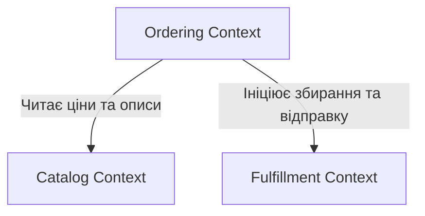

# Стратегічний дизайн системи GamingStore

**Курс:** Технології доменної інженерії  
**Лабораторна робота №3**

## 1. Виявлення подій та команд (Event Storming Lite)

Аналіз бізнес-процесів платформи GamingStore дозволив виділити наступні ключові події (Domain Events), команди (Commands) та згрупувати їх навколо агрегатів (Aggregates), які відповідають за консистентність даних.

1. Агрегат: ShoppingCart (Кошик покупок)
   Відповідає за процес формування замовлення клієнтом до моменту фіксації ціни.
   • Commands (Команди):
   o AddProductToCart (Додати товар у кошик)
   o RemoveProductFromCart (Видалити товар з кошику)
   o ClearCart (Очистити кошик)
   • Domain Events (Події):
   o ProductAddedToCart (Товар додано до кошику)
   o ProductRemovedFromCart (Товар видалено з кошику)
   o CartCleared (Кошик очищено)
2. Агрегат: Order (Замовлення)
   Центральний агрегат, що фіксує намір клієнта придбати товари за узгодженою на цей момент ціною.
   • Commands (Команди):
   o PlaceOrder (Оформити замовлення)
   o CancelOrder (Скасувати замовлення)
   • Domain Events (Події):
   o OrderPlaced (Замовлення успішно оформлено)
   o OrderCancelled (Замовлення скасовано користувачем або системою)
3. Агрегат: Payment (Оплата)
   Відповідає за фінансові транзакції та їхні статуси.
   • Commands (Команди):
   o RequestPayment (Створити запит на оплату)
   o ProcessPayment (Обробити платіж через еквайринг)
   o FailPayment (Зафіксувати невдалу оплату)
   • Domain Events (Події):
   o PaymentRequested (Створено форму для оплати)
   o PaymentSucceeded (Оплату успішно отримано)
   o PaymentFailed (Оплату відхилено банком)
4. Агрегат: Inventory (Складські запаси)
   Відповідає за контроль наявності товарів (фізичних копій ігор чи консолей).
   • Commands (Команди):
   o ReserveStock (Зарезервувати товар під замовлення)
   o DeductStock (Остаточно списати товар зі складу)
   o ReleaseStock (Повернути товар з резерву у вільний продаж)
   • Domain Events (Події):
   o StockReserved (Необхідну кількість товару зарезервовано)
   o StockDeducted (Товар успішно списано)
   o StockReleased (Резерв знято, товари повернуто на полицю)
   o OutOfStock (Зафіксовано нестачу товару для резервування)
5. Агрегат: Shipment (Доставка)
   Відповідає за логістичний процес після успішної оплати.
   • Commands (Команди):
   o PrepareShipment (Почати комплектування)
   o DispatchShipment (Передати в службу доставки)
   o DeliverShipment (Вручити клієнту)
   • Domain Events (Події):
   o ShipmentPrepared (Замовлення укомплектовано)
   o ShipmentDispatched (Замовлення відправлено клієнту)
   o ShipmentDelivered (Доставку успішно завершено)

## 2. Обмежені контексти (Bounded Contexts)

Для забезпечення балансу між чистотою архітектури та складністю технічної реалізації, систему декомпоновано на 3 обмежених контексти. Розділення проведено на основі лінгвістичних та процесних розривів.

1. Catalog Context (Каталог та Вітрина)
   Зона відповідальності: Управління асортиментом товарів, їхніми описами, цінами та категоріями. Забезпечує роботу вітрини магазину для клієнтів.
   • Обґрунтування меж (Евристики):
   o Різні відповідальні особи: Цим контекстом керують контент-менеджери та маркетологи. Їм нецікаво, як товар доставляється, їм важливо, як він виглядає на сайті.
   o Термінологія: Тут Product — це сутність із картинками, текстом та базовою ціною.
2. Ordering Context (Управління замовленнями та Продажі)
   Зона відповідальності: Робота з кошиком користувача, оформлення покупки (Checkout), фіксація фінальної ціни та обробка оплати.
   • Обґрунтування меж (Евристики):
   o Розрив у часі: Оформлення та оплата замовлення відбуваються "тут і зараз" (синхронно). Щойно оплата пройшла — відповідальність цього контексту закінчується.
   o Термінологія: Тут Product перетворюється на OrderLine — рядок у чеку з жорстко зафіксованою кількістю та ціною, яка вже не зміниться, навіть якщо в Каталозі ціна завтра зросте.
3. Fulfillment Context (Виконання та Склад)
   Цей контекст логічно об'єднує процеси Inventory та Shipping для спрощення кодової бази.
   • Зона відповідальності: Фізичне управління залишками товарів (резервування, списання), пакування та відправка замовлення клієнту.
   • Обґрунтування меж (Евристики):
   o Розрив у часі: Процес збирання посилки на складі та її доставка відбуваються пізніше і можуть тривати кілька днів.
   o Термінологія: Тут Product — це StockItem (Складська одиниця). Цьому контексту абсолютно байдуже на гарний опис гри чи її картинку, для нього мають значення лише SKU (артикул) та кількість на полиці.
   o Різні відповідальні особи: Роботу виконують комірники та логісти.

### Діаграма взаємодії (Context Map)

---

## 3. Єдина мова (Ubiquitous Language)

Нижче наведено словники термінів для кожного обмеженого контексту. Головна особливість цієї моделі — концепція «Товару» (Product), яка кардинально змінює своє значення та набір атрибутів залежно від того, в якому бізнес-процесі вона бере участь.

1. Catalog Context (Каталог та Вітрина)
   Тут бізнес мислить категоріями маркетингу та привабливості для клієнта.
   • Product (Товар) — одиниця асортименту на вітрині. Містить маркетинговий опис, скріншоти, відео, технічні вимоги та базову ціну. Для каталогу це "вітринний зразок".
   • Category (Категорія) — логічне групування товарів (наприклад, "Шутери", "Консолі") для зручної навігації клієнта по сайту.
   • Publisher / Brand (Видавець / Бренд) — компанія, яка створила або випустила товар (наприклад, Sony, Electronic Arts).
   • Display Price (Вітринна ціна) — базова вартість товару до застосування будь-яких персональних знижок чи промокодів під час оформлення.
   • Tag (Тег / Характеристика) — додаткові мітки для фільтрації (наприклад, "Мультиплеєр", "Підтримка геймпада").
2. Ordering Context (Управління замовленнями та Продажі)
   Тут бізнес мислить категоріями грошей, домовленостей та фіксації умов.
   • Order Line (Рядок замовлення) — це трансформація "Товару" в контексті продажів. Це конкретна позиція в чеку покупця. Вона більше не має опису чи скріншотів, натомість має зафіксовану ціну (яка не зміниться, навіть якщо в каталозі товар подорожчає) та кількість.
   • Order (Замовлення) — зафіксований намір клієнта придбати обрані рядки замовлення за узгодженою фінальною ціною.
   • Checkout (Оформлення) — бізнес-процес перетворення попереднього кошика на підтверджене замовлення із фіксацією умов доставки та оплати.
   • Final Price (Фінальна ціна до сплати) — точна сума грошей, яку клієнт повинен переказати магазину після застосування всіх можливих знижок та вартості доставки.
   • Payment Status (Статус оплати) — індикатор того, чи виконав клієнт свої фінансові зобов'язання (Очікує оплати, Сплачено, Відхилено банком).
3. Fulfillment Context (Виконання та Склад)
   Тут бізнес мислить фізичними об'єктами, коробками, полицями та логістикою.
   • Stock Item / SKU (Складська одиниця / Запас) — це трансформація "Товару" в контексті складу. Для комірника це просто фізична коробка. Вона має лише унікальний артикул (SKU), штрих-код, вагу, габарити та точне місце розташування на полиці (стелаж/ярус).
   • Available Quantity (Доступний залишок) — кількість одиниць певного артикулу, які фізично лежать на складі і готові до продажу новим клієнтам.
   • Reserved Quantity (Резерв) — одиниці товару, які фізично ще знаходяться на складі, але вже обіцяні іншому клієнту (належать до неоплаченого або невідправленого замовлення).
   • Shipment / Package (Відправлення / Посилка) — фізична коробка, у яку спаковані складські одиниці, готова до передачі кур'єрській службі.
   • Delivery Address (Адреса доставки) — фізичні координати або відділення пошти, куди логістичний партнер має доставити посилку.
