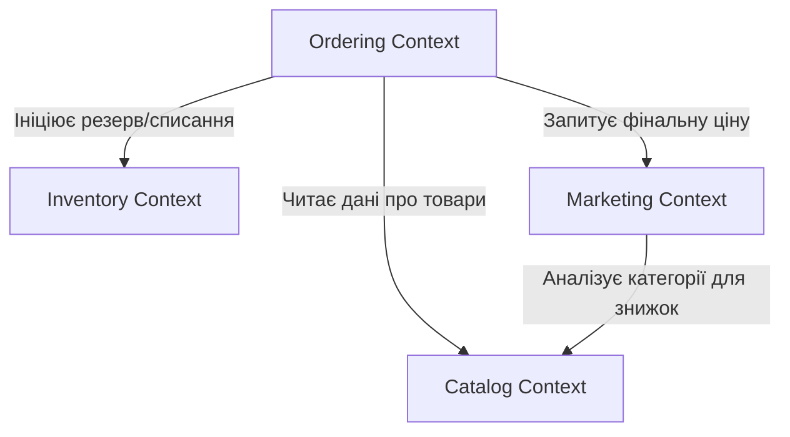

# Стратегічний дизайн системи GamingStore

**Курс:** Технології доменної інженерії  
**Лабораторна робота №3**

## 1. Виявлення подій та команд (Event Storming Lite)

Аналіз бізнес-процесів дозволив виділити ключові агрегати та події, що змінюють стан системи.

### Агрегат: Order (Замовлення)

- **Команди:** `PlaceOrder`, `ConfirmOrder`, `ShipOrder`, `CancelOrder`.
- **Події:** `OrderPlaced`, `OrderConfirmed`, `OrderShipped`, `OrderCancelled`.

### Агрегат: Inventory (Склад)

- **Команди:** `ReserveInventory`, `DeductInventory`, `ReleaseInventory`.
- **Події:** `InventoryReserved`, `InventoryDeducted`, `InventoryReleased`.

### Агрегат: Marketing & Loyalty (Маркетинг та лояльність)

- **Команди:** `ApplyPromoCode`, `UpdateLoyaltyTier`.
- **Події:** `PromoCodeApplied`, `LoyaltyTierUpgraded`, `DiscountCalculated`.

---

## 2. Обмежені контексти (Bounded Contexts)

Систему декомпоновано на 4 основні контексти, кожен з яких має чітку бізнес-мету:

1.  **Catalog Context:** Керування вітриною, описами ігор та категоріями.
2.  **Ordering Context:** Обробка кошика, процес оформлення та життєвий цикл замовлення.
3.  **Inventory Context:** Облік залишків, фізичне резервування та списання товарів.
4.  **Marketing Context:** Система лояльності користувачів, обчислення знижок та перевірка промокодів.

### Діаграма взаємодії (Context Map)

---

## 3. Єдина мова (Ubiquitous Language)

Нижче наведено словники термінів для кожного обмеженого контексту. Вони розроблені для уникнення технічного жаргону та забезпечення однозначного розуміння бізнес-процесів усіма учасниками команди.

### Catalog Context (Каталог товарів)

| Термін                   | Опис                                                                     |
| :----------------------- | :----------------------------------------------------------------------- |
| **Product** (Товар)      | Одиниця асортименту (гра, приставка), що має назву, опис та базову ціну. |
| **Category** (Категорія) | Групування товарів (наприклад, RPG, Shooter) для навігації на вітрині.   |
| **Brand** (Бренд)        | Виробник або видавець програмного чи апаратного забезпечення.            |

### Ordering Context (Управління замовленнями)

| Термін                            | Опис                                                                                                   |
| :-------------------------------- | :----------------------------------------------------------------------------------------------------- |
| **Order** (Замовлення)            | Офіційно зафіксований намір клієнта придбати набір товарів за вказаною ціною.                          |
| **Order Line** (Рядок замовлення) | Елемент у списку замовлення, що вказує на конкретний товар, його кількість та ціну на момент фіксації. |
| **Status** (Статус замовлення)    | Поточний етап обробки замовлення (Очікує, Підтверджено, Відправлено, Доставлено, Скасовано).           |

### Inventory Context (Складський облік)

| Термін                                   | Опис                                                                                               |
| :--------------------------------------- | :------------------------------------------------------------------------------------------------- |
| **Stock Item** (Запас)                   | Одиниця товару в межах складу, що характеризується лише фізичною наявністю.                        |
| **Available Stock** (Доступна кількість) | Кількість одиниць товару, які можна вільно зарезервувати для нових замовлень.                      |
| **Reserved Stock** (Резерв)              | Одиниці товару, які фізично знаходяться на складі, але вже закріплені за оформленими замовленнями. |

### Marketing Context (Маркетинг та ціноутворення)

| Термін                               | Опис                                                                                                                |
| :----------------------------------- | :------------------------------------------------------------------------------------------------------------------ |
| **Promotion** (Акція)                | Маркетингова активність, що надає тимчасову знижку на певні категорії чи товари.                                    |
| **Loyalty Tier** (Рівень лояльності) | Статус користувача (Bronze, Silver, Gold), що базується на його історії покупок та дає право на персональну знижку. |
| **Final Price** (Фінальна ціна)      | Розрахункова вартість товару після врахування базової ціни, акцій та персональних знижок.                           |
